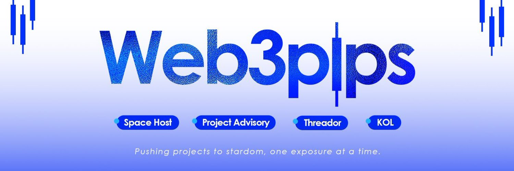
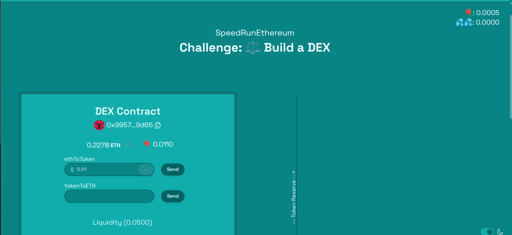
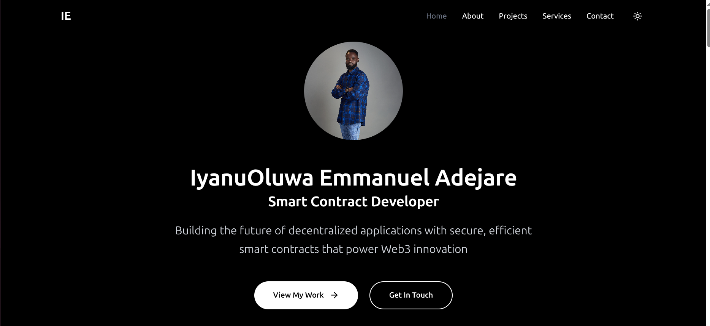

# Hi there, I'm IyanuOluwa Emmanuel Adejare! 👋

## About Me

I am passionate about **building solutions with solidity and Java** with experience in **the teaching profession as a B. Sc. (Ed.) Mathematics graduate and a finacial strategist**. I love tackling complex problems, learning new skills, and collaborating with diverse teams to create innovative solutions.

- Currently learning: **Solidity, Java and React**
- Working on: **A personal financial growth framework system**
- Languages: **HTML, CSS, JAVASCRIPT, SOLIDITY, JAVA**
- How to reach me: **iyanuoluwaadejare2025@gmail.com**
- Fun fact: **I can't help but see problems, so I am here building & shipping solutions in codes and apps - instead of complaining and waiting for someone else to do it.**

## My Skills 🧠

## Featured Projects 💻

### [Decentralized Exchange](https://dex-challenge-beta.vercel.app/dex)

This **Decentralized Exchange project** is a **fullstack blockchain website for safe swapping of decentralized assets (for this sample project, we used 2 tokens, $BAL & $ETH)**. Built with **Next.js in the frontend and Solidity in the backedn**. You can check out the repository [here](https://github.com/IyanuOluwa001/Decentralized-Exchange-Hardhat-Solidity-Project).

### [Website Portfolio](https://iyanuoluwa-portfolio.vercel.app/)

**This portfolio Website** is a **simple website dedicated to showcasing my skillset to potential employers and friends** built with **React using Vite** for quick light deployment. You can check out the repository [here](https://github.com/IyanuOluwa001/iyanuoluwa-portfolio).

## Get in Touch 📬

- **Website:** https://iyanuoluwa-portfolio.vercel.app
- **LinkedIn:** https://www.linkedin.com/in/iyanuoluwa-emmanuel-adejare/
- **Twitter:** https://www.x.com/web3pips